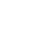
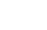
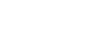
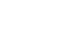
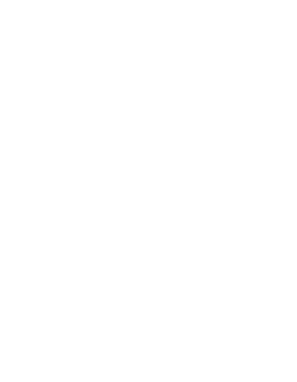
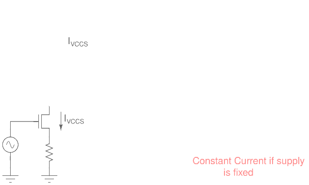
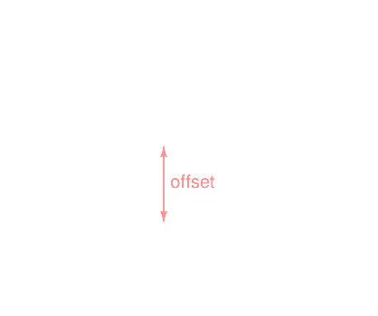
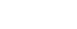

#### Table of Contents

- [Why modify the current generator portion of VCO?](#why-modify-the-current-generator-portion-of-vco)
- [Constraints on VCO Gain for an XOR DPLL](#constraints-on-vco-gain-for-an-xor-dpll)
- [Problem with the unmodified Current Generator - No Lower frequency limit](#problem-with-the-unmodified-current-generator---no-lower-frequency-limit)
  - [*Fixing a lower limit to output frequency by adding a constant current to Input Controlled Current*](#fixing-a-lower-limit-to-output-frequency-by-adding-a-constant-current-to-input-controlled-current)
- [Implementing this current source - Simple resistor as a pull down load](#implementing-this-current-source---simple-resistor-as-a-pull-down-load)
- [Any possible issue with supply dependance?](#any-possible-issue-with-supply-dependance)
  - [*Not Convinced with the above reason?*](#not-convinced-with-the-above-reason)

 

# Why modify the current generator portion of VCO?

In Ch 19.3.1, the XOR DPLL, while discussing the VCO, JBK adds a resistor to **set the lower frequency**.

> Consider the schematic seen in Fig. 19.25 of the current generator portion of the VCO (see Fig. 19.17). Here, we’ve added a resistor **Rlow** to set the lower frequency range of the VCO (which makes the VCO very dependent on the power supply voltage). The range is still set by M5R. However, now we’ve increased the value of the resistor to limit the VCO’s output frequency range.

See Fig 19.25 for this change:

\[*Ref: CMOS Circuit Design, Layout and Simulation*]

Naturally, the question is, why was this modification made, and how can this be designed?

 

# Constraints on VCO Gain for an XOR DPLL

For XOR DPLL, VCOs should have extrememly low gain, or extremely low output frequency range. This is necessary because:

> 
The XOR DPLL will lock on harmonics of the data... The VCO operating frequency range should be limited to frequencies much less than 2fclock and much greater than 0.5fclock , where fclock is the nominal clock frequency for proper lock with a XOR PD.

In other words, if your center frequency of oscillation is, fcenter = 100 MHz, **then you want your fmin and fmax to be close to that** in order for the XOR DPLL to obtain a lock!

For example, see the TF (Transfer Function) of this modified VCO which will be used in this XOR DPLL:

\[*Ref: CMOS Circuit Design, Layout and Simulation - Figure 19.26*]

> 📝 **NOTE:** Lowest Frequency is not 0 MHz. This observation is very important.

Clearly, in the above TF, fmin is limited to a frequency that is close to fcenter and not 0 MHz.

 

# Problem with the unmodified Current Generator - No Lower frequency limit

In the unmodified current generator (See below figure), since the VCCS (Voltage Controlled Current Source) is implemented using a MOSFET, as the input voltage is reduced the output current will also reduce without saturating to a limit.

\[*Ref: CMOS Circuit Design, Layout and Simulation - Figure 19.17*]

One can easily say that when voltage goes low enough (such that VGS < VTH), the output current goes to 0 (technically, to lower orders of magnitudes, i.e. nA and pA range). In such cases, the oscillator cannot sustain a desired oscillation frequency (technically, with low current, fosc will be unpredictable), and so, there is no lower limit to the output frequency range.

This is also seen in the following TF of this VCO:

\[*Ref: CMOS Circuit Design, Layout and Simulation - Figure 19.18*]

 

> ⚠️ **This is bad for XOR DPLL as output clock edge will wander in time (severe jitter).**

 

## *Fixing a lower limit to output frequency by adding a constant current to Input Controlled Current*

 

The solution to the lower limit problem is concocted from the observation that VCCS MOSFET shuts off as input voltage goes low and Output current also goes low.

> 💡 What if we add a constant current along with the input controlled current? Like a current source in parallel with MOSFET?

Like the one shown below:

When this is done, *even if IVCCS where to vanish, thanks to current source pulling a non-zero current at all times, the VCO's output frequency will now have a lower limit!*

 

# Implementing this current source - Simple resistor as a pull down load

If the VCCS is off, that is VIN is so low, then, you have only the current source as a pull down. So, in that case, consider this modification:

 

The benefit of this modification is **it sets a lower frequency limit (i.e. a lower current limit) regardless of input voltage** and so, the TF seems to get an offset.

 

 

And this is desirable, as the VCO cannot wander to lower frequencies thanks to the lower limit.

> 📋 Thus, the addition of resistor limits the lower frequency by sinking a non-zero current even if VCCS MOSFET turns off.

 

# Any possible issue with supply dependance?

 

Of course, Diode Connected PMOS and Resistor together forms a voltage divider, which heavily depends on supply. But, That is not a concern as the PLL is an extremely sensitive circuit and generally, such circuit blocks gets accompanied by Supply regulators (LDO).

 

## *Not Convinced with the above reason?*

 

Imagine, even if we make the current source somehow independant of supply voltage, because we're using the ring oscillator topology, the frequency of oscillation is still dictated by supply voltage!

I mean think about it, Ring oscillator is just a bunch of inverters (in odd number of quantity, very important) connected in a loop. If supply drops down, then the inverter output voltage range also drops down, thereby making it easier to cover this reduced range in little time (i.e. frequency has changed).  
There's no point in making a supply independant current source, when the VCO itself has so much supply dependance. Let's just push it onto the regulator from a system perspective and relax!