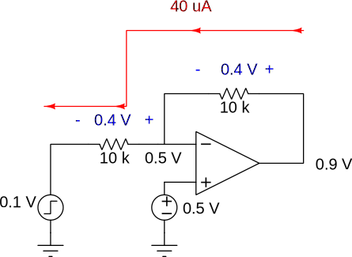
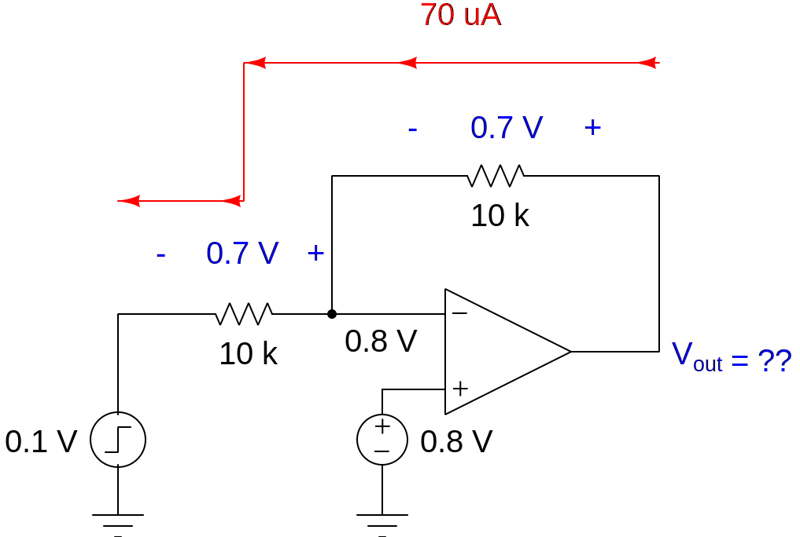
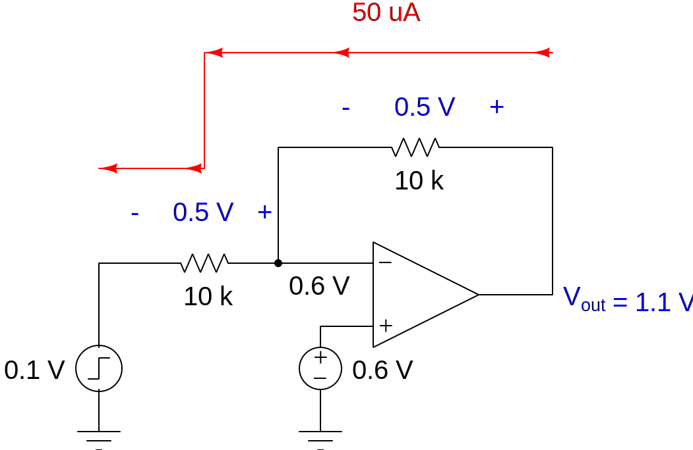
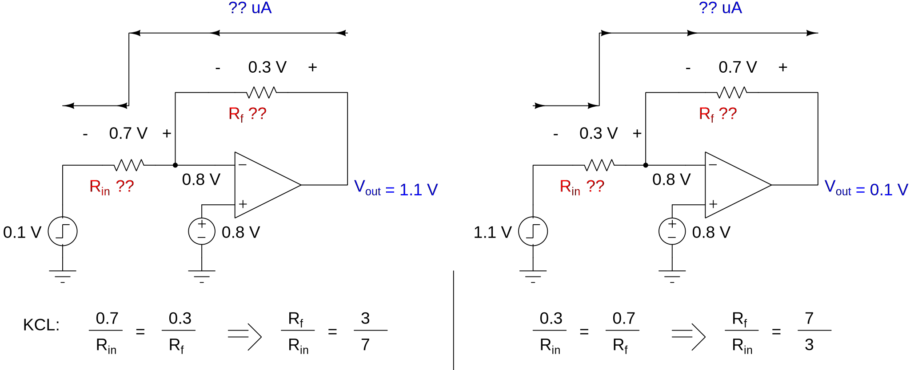

# Choice for Feedback Resistors and Input sweep
JBK uses a sweep plan that sweep till rails, i.e. from 0.1V (Near GND) to 0.9V (Near VDD). That's not achievable in our op-amp for various reasons.

Let's look at the case when `Vin = 0.1V` and `Vout = 0.9V` (Note: JBK uses 50nm process. VDD = 1.0 V).

When that happens see the voltages (Steady state) that develop at the nodes as shown here:

Because the common-mode is at `0.5 V` (Which is `VDD/2 = 1/2 = 0.5 V`) and input is at `0.1 V`, the voltage drop across input resistor, `Rin` is `0.4 V`. And because the feedback resistor `Rf` is also in series with input resistor `Rin`, the same current flows through both of them (`40 uA`) and hence develop the same voltage of `0.4 V`.

So, what could be `Vout` when it is `0.4 V` above `V-` terminal which is at `0.5 V`?

Vout = 0.4 V + 0.5 V = 0.9 V

## What's wrong with our circuit though?
Our Op-amp doesn't include `Vdd/2 = 1.2/2 = 0.6 V` in it's ICMR (Input Common Mode Range). Our ICMR range is: `0.7 V` to `1.1 V`.

Let's take ICM (Input Common Mode) of `0.8 V`, and let's try to see what happens `Vin` is `0.1 V`.

Just like before, same resistors, same current, same voltage drop of `0.7 V` (Note that our op-amp `V-` terminal is at `0.8 V` and not at `0.5 V`. Don't get confused.). So, `Vout` is `0.7 V` above `V-` terminal which is at `0.8 V` thanks to feedback action.

Vout = 0.7 V + 0.8 V = 1.5 V > VDD = 1.2 V 

This is impossible to achieve as real op-amp output swing is limited by rails. That's why we can't sweep till rails with our op-amp, as it is limited by ICMR.

## If we had VDD/2 in our ICMR?
If we had, then our circuit will look like this:

And here, `Vout` is within Positive supply rail.

# Can we do something to accomodate this swing in our op-amp?
No we can't. The only way to do that is to synthesize a **Non-linear Function** using resistors and diodes. Let me explain why.

See the two different cases illustrated below:

<!-- Note, the width = 459px * 2 = 918 px. Because, two such images are present in single file -->

Both cases require `Rf/Rin` ratio to be different, which is clearly not possible with ordinary resistors.

## A possible - IDEAL solution
If you use diodes to select the appropriate path, then you can use a network like this:

The diodes will forward bias only when `Vin` goes above critical value. But, again it is a STUPID IDEA.

So, I hope that explains why we can't have symmetrical swings around the rails.

# SUMMARY
We can't do an excitation that sweeps near rails because:
1) ICMR doen't have `VDD/2`, so, you don't have a mid point.
2) Assymtrical sweeps need two different Feedback ratios to achieve output swing within supply rails, which is again impossible as disscussed.